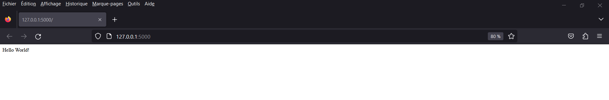

# TodoApp
This app is a task manager that allows users to organize their to-do lists efficiently. With the new features added, it is now even more user-friendly and convenient.

New Features:
Due Date:
The app now includes a "due date" field for each task. This feature helps users keep track of upcoming deadlines and prioritize their tasks accordingly.

Task Completion:
Users can now mark their tasks as completed by clicking on the green button next to each task. 
Once completed, the task will be highlighted in green and moved to the bottom of the list. 
This feature enables users to monitor their progress and feel a sense of accomplishment.

Importance Sorting:
Tasks are now sorted based on their degree of importance. The most important tasks will appear at the top of the list, making it easier for users to focus on what 
matters most.

Authentication System:
TodoApp now includes a secure authentication system, ensuring that user data is protected at all times. Users must create an account and log in to access the application. 
This feature helps maintain privacy and keeps user data safe.

Screenshots:
Here are some screenshots of the app working:

Usage:
To use the app, simply add your tasks to the list and include the due date. You can then sort the tasks based on their importance and mark them as completed when done.
The app will automatically update the task list and highlight completed tasks in green.

Conclusion:
With these new features, TodoApp makes task management even easier and more efficient. Users can now add due dates, mark tasks as completed, and sort tasks by importance.
The authentication system adds an extra layer of security, making TodoApp a reliable and trustworthy application for managing tasks.
